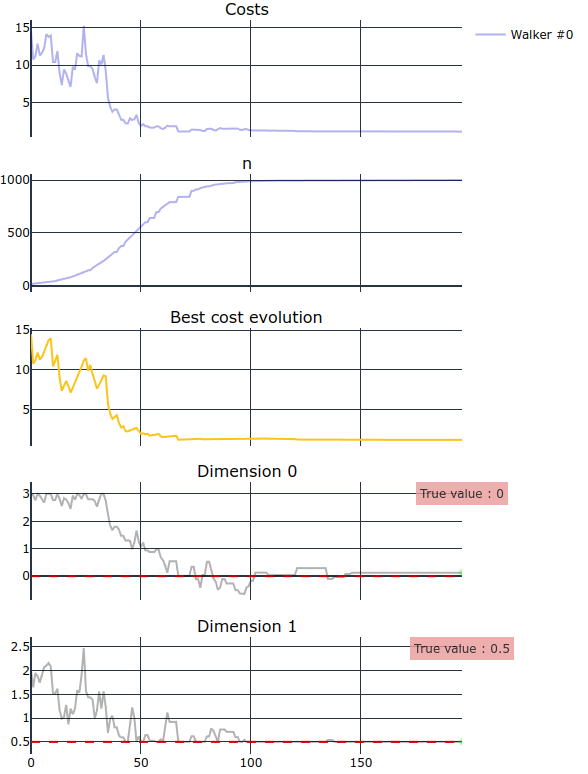

# Josiann - Just anOther SImulated ANNealing

This library uses a modified version of the simulated annealing algorithm for minimizing noisy cost functions. 
This implementation is adapted from [^1]. It is expected that the cost function has the form `f(x) = g(x) + e(x)`, 
where e(x) is an error term of mean 0 and is symmetrical.

Briefly, to allow convergence of the algorithm with noisy cost functions, multiple evaluations are averaged together to 
reduce the amount of noise. The exact number of evaluations to be averaged depend on the Temperature variable and on 
the max allowed number of evaluations, but grows with the iterations.

## Description

Four variants of the algorithm have been implemented : 3 sequential variants and 1 parallel.

### Sequential variants

Sequential variants optimize **ONE** cost function at a time. The cost function can be any dimensional.
Those variants are `sa`, `vsa` and `mcsa`.

- `sa` is the base version of the algorithm.
- `vsa` expects vectorized cost functions to compute multiple evaluations of the function at once (either multiple 
  evaluations at the same point, or at different points when possible to test moves in advance). 
- `mcsa` expects regular cost functions but runs on multiple CPU cores to obtain multiple evaluations of the 
  function faster.

Note : Both `sa` and `mcsa` expect cost functions of the form `f: n-dim vector --> float`.
*vsa* expects functions of the form `f: n⋅m matrix --> m-dim vector` (m is the number of evaluations to compute).

All three variants ca be imported with :

```python
from josiann import sa, vsa, mcsa
```

### Parallel variant

The sequential variant `psa` optimizes multiple cost functions in parallel. The cost functions can be 
any-dimensional but must be the same in each parallel optimization task. 
As for `vsa`, `psa` expects cost functions of the form `f: n⋅m matrix --> m-dim vector`.

Similarly, the parallel variant can be imported with :

```python
from josiann import psa
```

### Parameters

Common parameters are :
- fun: the cost function to optimize
- x0: a vector (or matrix) of initial positions
- args: additional arguments to be passed to `fun`. Those arguments are constant and will not be updated by the 
  optimization algorithm.
- bounds: Optionally, min and max bounds for each dimension can be defined to limit the optimization search space.
- moves: one or more moves to update position vectors.
- max_iter: maximum number of iterations to compute before stopping the optimization algorithm.
- max_measures: maximum number of function evaluations to compute at a single position.
- T_0: initial value for the Temperature parameter.
- detect_convergence: whether to stop the optimization algorithm before reaching `max_iter` if convergence is detected.
- tol: tolerance for detecting convergence.
- window_size: number of iterations to consider for detecting convergence, computing the fraction of accepted moves 
  and finding the best position reached (the position with the lowest associated cost).
- seed: an optional seed value to fix the randomness.

### Walkers

With special moves (ensemble moves), it is possible to obtain more information about the cost function to optimize 
by evaluating it in multiple points. 
To do so, the algorithms defined here allow to have multiple `walkers`. Each walker is defined by its position 
vector and associated cost. At each iteration, the position of each walker is updated by the ensemble move, by 
taking into account the position of other walkers.

The parameter `nb_walkers` allows the user to choose how many walkers to have.

Note: When using `vsa`, it is possible to vectorize on walkers: the cost for the position of all walkers will be 
computed at once. To do so, set parameter `vectorized_on_evaluations` to `False`. 

### Convergence detection

Convergence is computed using the Root-Mean-Squared Deviation (RMSD) of the last `window_size` obtained costs (this 
is computed for each walker independently). If the RMSD value drops below `tol`, the walker is considered to have 
converged at will not be updated in later iterations. 

This reduces the computation time by dropping unnecessary evaluations of the cost function and can lead to faster 
results when all walkers converge before `max_iter` is reached.

## Moves

Moves define how a position vector (the point of function evaluation) must be modified at each iteration to generate 
new candidate positions.

Some commonly used moves have been implemented :
- `Metropolis` (next position is drawn at random from a multivariate normal distribution centered at the current position)
- `Metropolis1D` (same as `Metropolis` but only one dimension is updated per iteration.)
- `RandomStep` (next position is generated by incrementing one coordinate of the current position vector by a random 
  value. The updated coordinate is chosen at random.)

Ensemble moves (moves with multiple walkers):
- `Stretch` (Adapted from [^2])
- `StretchAdaptative` (Adapted from [^2] with varying parameter `a`.)

Also implemented are some discrete moves :
- `SetStep` (A set of possible positions `{x_1, ..., x_p}` is defined for each dimension of the position vector. At 
  each iteration, one of the elements of the current position vector `x_k` is updated by choosing at random the 
  left or right neighbor in the set of positions (`x_k-1` or `x_k+1`).)
- `SetStretch` (Modified version of the `Stretch` move with a defined set of possible positions (during the stretch 
  process, the closest value in the set is chosen).)

## Backup

When using discrete moves, it is possible to store previously computed costs. Indeed, the probability for a walker 
to reach the same position twice is high, especially with final iterations where the walker does not move much. When 
the backup is active, positions and associated costs are stored so that only `n-s` evaluations need to be computed 
instead of `n`, where `s` is the number of already computed function evaluations at the same position.

To activate the backup, set the `backup` parameter to `True`.

## Result and Trace

Optimization algorithms return a `Result` object, which contains :
- a `success` boolean value to indicate if the optimization process was successful.
- a final `message` string with details on the success.
- a `Trace` object which stores reached positions at each iteration and provides functions for plotting those positions.

## Example

The following code will demonstrate a basic use case.

First we define a cost function. Here the function take an n-dimension position array and returns a single float cost 
value. 

```python
import numpy as np
import numpy.typing as npt

def cost_function(x: npt.NDArray[np.float64]) -> float:
    return np.sum(x ** 2) + np.random.normal(0, 3)
```


Then we run the optimization algorithm : 

```python
from josiann import sa
from josiann.moves import Metropolis

x0 = np.array([[np.random.randint(-3, 4),                                   # random number in (-3, 3)
                np.random.choice(np.linspace(0.5, 5, 10))]])                # random number in (0.5, 5)

res = sa(cost_function,
         x0,
         bounds=[(-3, 3), (0.5, 5)],
         moves=Metropolis(np.array([0.1, 0.1])),
         max_iter=200,
         max_measures=1000,
         T_0=5,
         seed=42)
```

Here we selected the Metropolis move, fixed bounds at (-3, 3) for dimension 1 and (0.5, 5) for dimension 2 and drew an 
initial position within those bounds. Given those bounds, the global minimum is at (0, 0.5).
The optimization was run for 200 max iterations and with 1000 max function evaluations.

```bash
T: 0.0026  A: 0.00%%  Best: 1.2325  Current: 1.2325:  93%|█████████▎| 186/200 [00:01<00:00, 169.23iteration/s]
```

It is then possible to plot the reached positions and associated costs :

```python
res.trace.plot_positions(true_values=[0, 0.5])
```



## References

[^1]: Gutjahr, Walter J., and Georg Ch Pflug. "Simulated annealing for noisy cost functions." Journal of global optimization 8, no. 1 (1996): 1-13.

[^2]: Goodman, Jonathan, and Jonathan Weare. "Ensemble samplers with affine invariance." Communications in applied mathematics and computational science 5, no. 1 (2010): 65-80.
